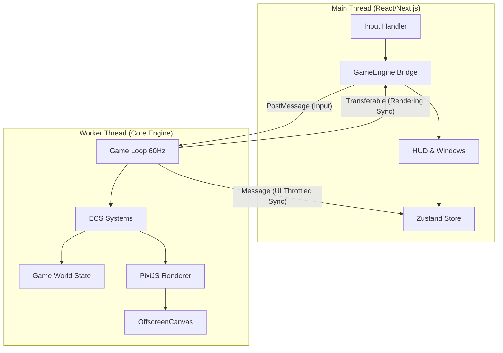

# 🏛️ 시스템 아키텍처 (System Architecture)

Drilling RPG는 고성능 게임 엔진의 성능과 최신 웹 프레임워크의 생산성을 결합하기 위해 **FSD(Feature-Sliced Design)** 레이아웃과 **멀티스레드 ECS(Entity Component System)** 패턴을 하이브리드로 사용합니다.

---

## 1. 전체 구조 (High-Level Overview)

프로젝트는 크게 **메인 스레드(UI)**와 **워커 스레드(Core Engine)**로 나뉩니다. 두 스레드는 메시지 패싱과 트리플 버퍼링을 통해 데이터를 동기화합니다.

---

## 2. 폴더 구조: FSD (Feature-Sliced Design)

프로젝트의 `src/` 디렉토리는 기능별 계층 구조를 따릅니다.

- **`app/`**: 애플리케이션의 시작점. 라이브러리 설정, 전역 레이아웃 및 라우팅을 담당합니다.
- **`widgets/`**: 여러 기능이 결합된 독립적인 UI 블록입니다. (예: `Hud`, `Shop`, `Inventory`)
- **`features/`**: 구체적인 비즈니스 가치를 가진 기능 단위입니다.
    - `features/game`: 메인 게임 루프 및 워커 관리 브리지.
    - `features/mining`: 채굴 로직 및 타일 상호작용.
    - `features/combat`: 몬스터 AI 및 전투 시스템.
- **`entities/`**: 게임의 핵심 도메인 모델입니다. 데이터 구조와 팩토리 함수를 포함합니다. (예: `player`, `world`, `tile`)
- **`shared/`**: 프로젝트 전반에서 재사용되는 인프라 코드입니다. (예: `lib/store.ts`, `types/game.ts`, `config/`)

---

## 3. 멀티스레딩 및 동기화 전략

### **메인 스레드 (Renderer & UI)**
- **역할**: 사용자 입력(키보드, 마우스) 수집 및 고수준 UI 관리.
- **렌더링**: 워커에서 보내온 렌더 데이터(Float32Array)를 로우 패스 필터를 통해 부드럽게 보간(Interpolation)하여 화면에 표시합니다.

### **워커 스레드 (Simulation Engine)**
- **역할**: 모든 게임 로직(물리, AI, 상태 변화)을 프레임당 1회(약 16.6ms) 수행합니다.
- **독립성**: UI 렌더링 부하에 관계없이 고정된 업데이트 주기를 유지하여 일관된 게임 환경을 보장합니다.

---

## 4. 고성능 ECS 및 SoA 아키텍처 (New)

성능 병목을 해결하고 가비지 컬렉션(GC)을 최소화하기 위해 **SoA(Structure of Arrays)** 기반의 ECS 구조를 채택했습니다.

### **Entity Manager (SoA Storage)**
- 모든 엔티티 데이터는 객체 배열이 아닌 `Float32Array`, `Uint16Array` 등의 연속된 메모리 버퍼에 저장됩니다.
- **Swap-and-Pop**: 엔티티 삭제 시 배열의 마지막 원소와 교체하여 $O(1)$ 삭제 성능을 보장하고 배열의 연속성을 유지합니다.
- **Generational Handles**: 인덱스 재사용 문제를 방지하기 위해 상위 16비트를 세대(Generation) 값으로 사용하는 고유 핸들 시스템을 도입했습니다.

### **최적화 시스템 (LOD & Culling)**
- **Spatial Hashing**: $O(N^2)$ 충돌 검사를 $O(N)$으로 줄이기 위해 공간 분할 그리드 시스템을 사용합니다.
- **Viewport Culling**: `SpatialHash`를 활용하여 현재 화면(Viewport) 근처의 엔티티 데이터만 선별적으로 렌더링 동기화 버퍼에 담아 전송합니다. (렌더링 부하 90% 이상 절감)
- **Logic LOD (Level of Detail)**: 플레이어와 멀리 떨어진 엔티티는 AI 및 물리 연산 빈도를 동적으로 조절(예: 60Hz -> 6Hz)하여 CPU 자원을 효율적으로 배분합니다.

---

## 5. 데이터 흐름 및 상태 동기화 (State & Sync)

게임의 모든 상태는 성격에 따라 메인 스레드(`Zustand`)와 워커 스레드(`ECS`) 두 곳으로 나뉘며 `postMessage` 프로토콜을 통해 비동기 통신합니다.

1.  **Input 및 Action**: 메인 스레드에서 수집된 키 입력 및 비즈니스 액션(구매, 장착 등)은 워커로 전송되어 엔진에서 유효성을 검증하고 최종 상태를 결정합니다.
2.  **고성능 렌더링 동기화**: 워커는 매 프레임 엔티티 SoA 데이터를 `Interleaved Float32Array`(트리플 버퍼링)에 패킹하여 메인으로 보냅니다.
3.  **UI 동기화 (Throttling)**: HP, 골드 등 저빈도 UI 통계(`PlayerStats`)는 5Hz(200ms) 주기로 Zustand 스토어를 통해 동기화되어 React 리렌더링 부하를 최소화합니다.

---

## 6. 성능 목표 (Performance Benchmarks)

- **Entity Capacity**: 최대 5,000 ~ 10,000개의 동적 엔티티 처리 지향.
- **Rendering**: 144Hz 주사율 대응 (Lerp 보간 엔진).
- **GC Pressure**: 0-Paused Time (객체 생성 최소화 및 Pooling 적극 활용).

상세한 동기화 전략은 [ADR: Ping-Pong Sync Strategy](adr/ADR_PING_PONG_SYNC.md)를 참조하세요.
