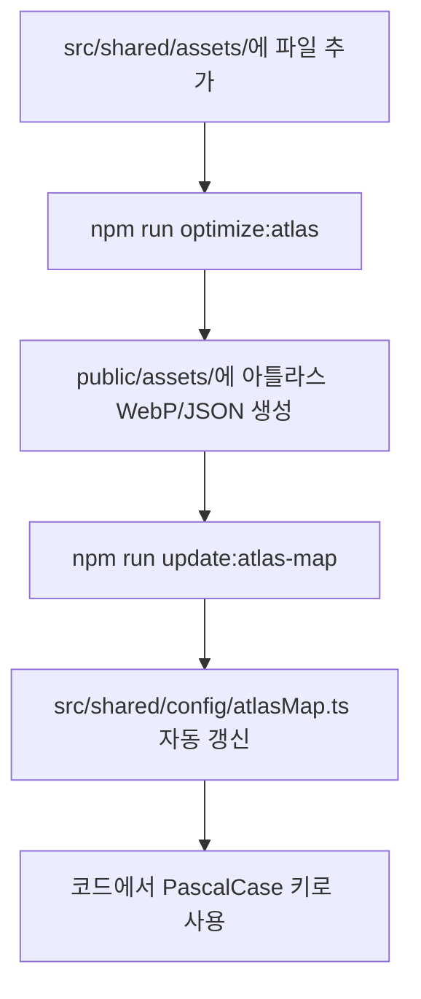

# [자산 가이드] 에셋 추가 및 아틀라스 파이프라인

이 문서는 게임 에셋을 추가하고 아틀라스 시스템에 등록하기 위한 전체 파이프라인을 설명합니다. 프로젝트는 **PascalCase** 명명 규칙과 **자동 ID 매핑** 시스템을 사용합니다.

---

## 1. 폴더 구조 및 명명 규칙

모든 원본 에셋(raw assets)은 `src/shared/assets/` 하위에 카테고리별로 관리됩니다.

| 폴더        | 용도              | 파일 명명 규칙        | 권장 해상도 (2x) | 포맷       |
| :---------- | :---------------- | :-------------------- | :--------------- | :--------- |
| `tiles/`    | 맵 타일 (1x1)     | `PascalCaseTile.png`  | **128x128**      | PNG        |
| `minerals/` | 광물 아이콘       | `PascalCaseIcon.png`  | **128x128**      | PNG (투명) |
| `rune/`     | 룬 스킬           | `PascalCaseRune.png`  | **1024x1024**    | PNG (투명) |
| `entities/` | 일반 몬스터 (1x1) | `PascalCase.png`      | **128x128**      | PNG (투명) |
| `entities/` | 거대 보스 (5x5)   | `PascalCase.png`      | **640x640**      | PNG (투명) |
| `drills/`   | 드릴 장비         | `PascalCaseDrill.png` | **256x256**      | PNG (투명) |
| `ui/icons/` | UI 시스템         | `PascalCaseIcon.webp` | **1024x1024**    | **WebP**   |

> [!TIP]
> **파일명이 곧 에셋 ID가 됩니다.** 예를 들어 `GoldIcon.png`는 코드에서 `GoldIcon`이라는 키로 즉시 사용 가능합니다.

---

## 2. 아틀라스 파이프라인 (전체 흐름)

에셋 등록 과정은 완전히 자동화되어 있습니다.



---

## 3. 새 에셋 추가 절차 (Step-by-Step)

에셋을 추가할 때 아래 4단계를 순서대로 수행하세요.

### Step 1: 파일 준비 및 배치

1.  **파일명**: 반드시 `PascalCase` 형식을 따릅니다. (예: `AbyssStoneIcon.png`)
2.  **형식**: 배경이 투명한 PNG 또는 WebP 형식을 권장합니다.
3.  **경로**: `src/shared/assets/` 하위의 아이템 성격에 맞는 폴더에 배치합니다.

### Step 2: 아틀라스 생성 및 동기화 (One-Command)

터미널에서 아래 명령어를 실행하면 이미지 최적화, 아틀라스 패킹, 그리고 ID 매핑 파일 생성이 한 번에 진행됩니다.

```bash
# 최적화 및 아틀라스 매핑 통합 명령어
npm run optimize:atlas && npm run update:atlas-map
```

### Step 3: 성공 여부 확인 (Validation)

정상적으로 등록되었는지 확인하려면 `src/shared/config/atlasFiles.ts`를 열어보세요.

- `ATLAS_FILE_MAPPING` 객체 안에 추가한 파일명이 키(Key)로 존재한다면 성공입니다.
- **실패 시**: 파일명이 `PascalCase`인지, 폴더 위치가 `src/shared/assets/` 하위인지 확인하세요.

### Step 4: 코드에서 사용

별도의 임포트(Import) 없이 파일명(ID)을 키로 즉시 사용합니다.

```tsx
// 1. UI 컴포넌트에서 사용
<AtlasIcon name="AbyssStoneIcon" size={48} />

// 2. 데이터 정의(Config)에서 사용
{
  id: 'abyss_stone',
  name: '심연석',
  image: 'AbyssStoneIcon', // 확장자 제외한 ID
  tileImage: 'AbyssStoneTile'
}
```

---

## 4. 특수 매핑 (Overrides)

일부 예외적인 경우(파일명과 ID를 다르게 유지해야 하는 하위 호환성 등)는 `scripts/generateAtlasMap.js`의 `SPECIAL_OVERRIDES` 객체에서 관리합니다.

| 원본 파일명       | 매핑된 ID      | 비고             |
| :---------------- | :------------- | :--------------- |
| `boss_core.png`   | `BossCoreTile` | 특수 타일 매핑   |
| `boss_skin.png`   | `BossSkinTile` | 특수 타일 매핑   |
| `MoneyIcon.webp`  | `GoldIcon`     | UI 시스템 아이콘 |
| `EmeralDrill.png` | `EmeraldDrill` | 오타 수정 매핑   |

---

## 5. 해상도 및 규격 가이드 (The 2x Rule)

본 프로젝트는 고해상도 디스플레이 대응을 위해 **논리적 크기(Logical Size) 대비 2배(2x)의 물리 해상도**를 권장합니다.

### 📏 타일 및 엔티티 기준

엔진의 기본 타일 단위(`TILE_SIZE`)는 **64px**입니다.

- **1x1 규격**: 논리 64px → **물리 128px** (정사각형)
- **5x5 규격**: 논리 320px → **물리 640px** (정사각형)
  - _예: 아스모데우스 보스는 5x5 타일을 점유하므로 640x640 에셋이 필요합니다._

### 🛠️ 장비 및 아이콘 기준

아이콘과 장비는 UI 레이어에서 디자인에 따라 다양한 크기로 표현됩니다.

- **광물**: 게임 화면과 인벤토리에서 주로 사용되므로 **128x128**을 권장합니다.
- **룬**: 스킬 상세 창 등에서 고품질 연출이 필요하므로 **1024x1024**를 유지하세요.
- **드릴/UI**: 상점 및 장비 창 대응을 위해 **256x256 ~ 1024x1024** 범위를 사용하세요.

---

## 6. 주의 사항 및 알려진 이슈

1.  **명명 규칙 준수**: 반드시 `PascalCase`를 사용하세요. `snake_case` 파일명은 지양합니다.
2.  **자동 생성 파일 수정 금지**: `src/shared/config/atlasFiles.ts`와 `atlasMap.ts`는 직접 수정하지 마세요.
3.  **투명도 처리**: 아이콘과 엔티티는 배경이 투명한 PNG/WebP여야 합니다.
4.  **아틀라스 한계**: 하나의 아틀라스 파일은 2048x2048 크기를 가집니다. 에셋이 많아지면 `game-atlas-N` 번호가 자동으로 늘어납니다.
5.  **색상 프로필**: sRGB 프로필을 권장하며, 웹 환경에서 색감이 틀어지지 않도록 최적화하여 저장하세요.

---

---

최종 갱신일: 2026-04-12
