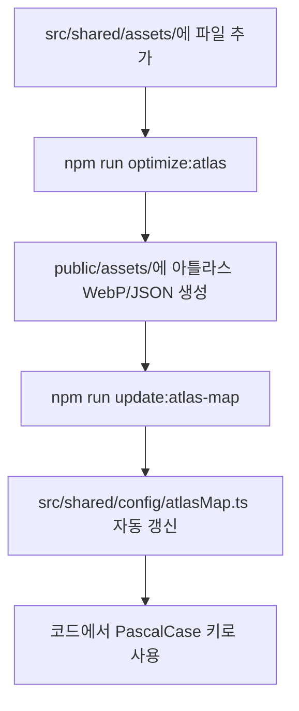

# [자산 가이드] 에셋 추가 및 아틀라스 파이프라인

이 문서는 게임 에셋을 추가하고 아틀라스 시스템에 등록하기 위한 전체 파이프라인을 설명합니다. 프로젝트는 **PascalCase** 명명 규칙과 **자동 ID 매핑** 시스템을 사용합니다.

---

## 1. 폴더 구조 및 명명 규칙

모든 원본 에셋(raw assets)은 `src/shared/assets/` 하위에 카테고리별로 관리됩니다.

| 폴더 | 용도 | 파일 명명 규칙 (ID 자동 추출) | 권장 해상도 | 포맷 |
| :--- | :--- | :--- | :--- | :--- |
| `minerals/` | 광물 아이콘 | `PascalCaseIcon.png` (예: `AmethystIcon.png`) | **1024x1024** | PNG (투명) |
| `tiles/` | 맵 타일 | `PascalCaseTile.png` (예: `AmethystTile.png`) | **128x128** | PNG |
| `drills/` | 드릴 장비 | `PascalCaseDrill.png` (예: `PlatinaDrill.png`) | 자유 | PNG (투명) |
| `rune/` | 룬 스킬 | `PascalCaseRune.png` (예: `HasteRune.png`) | **1024x1024** | PNG (투명) |
| `entities/` | 몬스터/보스 | `PascalCase.png` (예: `Minos.png`) | 자유 | PNG (투명) |
| `ui/icons/` | UI 시스템 | `PascalCaseIcon.webp` | 자유 | **WebP** |

> [!TIP]
> **파일명이 곧 에셋 ID가 됩니다.** 예를 들어 `GoldIcon.png`는 코드에서 `GoldIcon`이라는 키로 즉시 사용 가능합니다.

---

## 2. 아틀라스 파이프라인 (전체 흐름)

에셋 등록 과정은 완전히 자동화되어 있습니다.



---

## 3. 새 에셋 추가 절차

### Step 1: 규칙에 맞는 파일명으로 저장
에셋 성격에 맞는 폴더에 `PascalCase` 파일명으로 저장합니다.
- 예: `BloodStoneIcon.png` 를 `src/shared/assets/minerals/`에 복사.

### Step 2: 아틀라스 생성 및 동기화
터미널에서 아래 명령을 순서대로 실행합니다.
```bash
# 1. 이미지 최적화 및 아틀라스 패킹 (WebP)
npm run optimize:atlas

# 2. 아틀라스 좌표 및 ID 매핑 파일(atlasMap.ts, atlasFiles.ts) 갱신
npm run update:atlas-map
```

### Step 3: 코드에서 즉시 사용
별도의 매핑 등록 없이 파일명(확장자 제외)을 키로 사용합니다.
```tsx
// UI에서 사용
<AtlasIcon name="BloodStoneIcon" size={48} />

// 데이터 정의에서 사용
{
  key: 'bloodstone',
  image: 'BloodStoneIcon',
  tileImage: 'BloodStoneTile',
}
```

---

## 4. 특수 매핑 (Overrides)

일부 예외적인 경우(파일명과 ID를 다르게 유지해야 하는 하위 호환성 등)는 `scripts/generateAtlasMap.js`의 `SPECIAL_OVERRIDES` 객체에서 관리합니다.

| 원본 파일명 | 매핑된 ID | 비고 |
| :--- | :--- | :--- |
| `MoneyIcon.webp` | `GoldIcon` | UI 시스템 아이콘 |
| `dirt.png` | `DirtTile` | 레거시 파일명 대응 |
| `EmeralDrill.png` | `EmeraldDrill` | 오타 수정 매핑 |

---

## 5. 주의 사항 및 알려진 이슈

1.  **명명 규칙 준수**: 반드시 `PascalCase`를 사용하세요. `snake_case` 파일명은 지양합니다.
2.  **자동 생성 파일 수정 금지**: `src/shared/config/atlasFiles.ts`와 `atlasMap.ts`는 직접 수정하지 마세요. 스크립트 실행 시 덮어씌워집니다.
3.  **해상도**: 광물 아이콘 및 룬 아이콘은 **1024x1024** 권장입니다. (타일은 128x128 고정)
4.  **아틀라스 한계**: 하나의 아틀라스 파일은 2048x2048 크기를 가집니다. 에셋이 많아지면 `game-atlas-N` 번호가 자동으로 늘어납니다.

---
---
최종 갱신일: 2026-04-12
