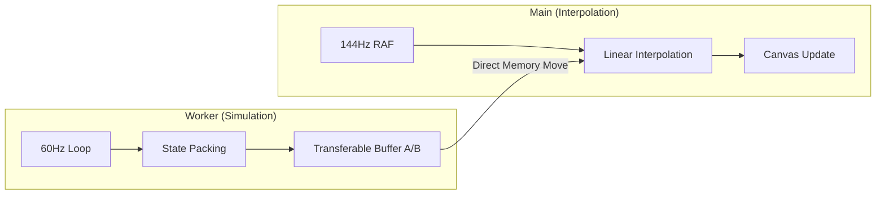

# 🎨 렌더링 파이프라인 (Rendering Pipeline)

Drilling RPG는 최신 웹 렌더링 기술인 **PixiJS v8**과 **OffscreenCanvas**를 활용하여 고주사율 환경에서도 끊김 없는 시각 경험을 제공합니다.

---

## 1. 멀티스레드 렌더링 엔진

### **A. 워커 스레드 (Worker Thread)**

- **PixiJS Application**: `OffscreenCanvas`를 전송받아 워커 내부에서 직접 WebGL/WebGPU 컨텍스트를 제어합니다.
- **Layers**: 게임은 다음과 같은 층(Layer) 구조로 렌더링됩니다.
  1.  **Tile Layer**: 지형 및 자원 타일. (SpriteBatching 활용)
  2.  **Entity Layer**: 플레이어, 몬스터, 드롭 아이템.
  3.  **Effect Layer**: 파티클 및 특수 효과.
  4.  **Light Layer**: 동적 조명 효과. (Multiply blending)
  5.  **UI Layer**: 인게임용 텍스트 필드 등.
- **Render Sync**: 매 프레임의 엔티티 상태를 `Float32Array`에 패킹하여 메인 스레드로 전송합니다.

### **B. 메인 스레드 (Main Thread)**

- **보간 루프 (Interpolation Loop)**: 브라우저의 전역 `requestAnimationFrame` 주기에 맞춰 워커에서 온 마지막 두 프레임 데이터를 선형 보간(Lerp)합니다.
- **결과**: 워커가 60Hz로 동작하더라도 144Hz 모니터에서 매끄러운 움직임을 감상할 수 있습니다.

---

## 2. 조명 시스템 (Lighting System)

### **커스텀 조명 필터 (`LightingFilter.ts`)**

- **기법**: 모든 레이어가 그려진 후 스테이지 전역에 적용되는 후처리 필터입니다.
- **작동 원리**:
  1.  전체 화면을 어둡게 설정(Ambient Light)합니다.
  2.  플레이어나 광원 엔티티 위치에 밝은 원형 그래디언트를 그립니다.
  3.  두 레이어를 곱셉(Multiply) 마스킹하여 동굴 내부의 어두운 분위기를 연출합니다.

---

## 3. 리소스 관리 (Asset Management)

### **텍스처 아틀라스 (Texture Atlas)**

- **최적화**: 수백 개의 작은 이미지를 하나의 큰 이미지(`atlas.webp`)로 묶어 관리합니다.
- **이점**: GPU의 텍스처 바인딩 횟수를 줄여 드로우 콜(Draw Call)을 대폭 감소시킵니다.
- **자동화**: `npm run optimize:atlas` 명령어를 통해 최신 자산을 자동으로 아틀라스로 패킹하고 `manifest.json`을 생성합니다.

---

## 4. 렌더링 동기화 도표

### **제로-카피 통신 (Zero-copy)**

워커에서 보낸 버퍼(`ArrayBuffer`)는 메인 스레드에서 직접 메모리 주소를 사용하므로 별도의 데이터 복사 비용이 발생하지 않습니다. 사용이 끝난 버퍼는 다시 워커로 반환(`RETURN_BUFFER`)되어 재사용됩니다.
